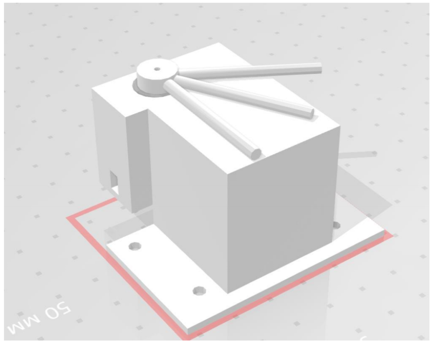
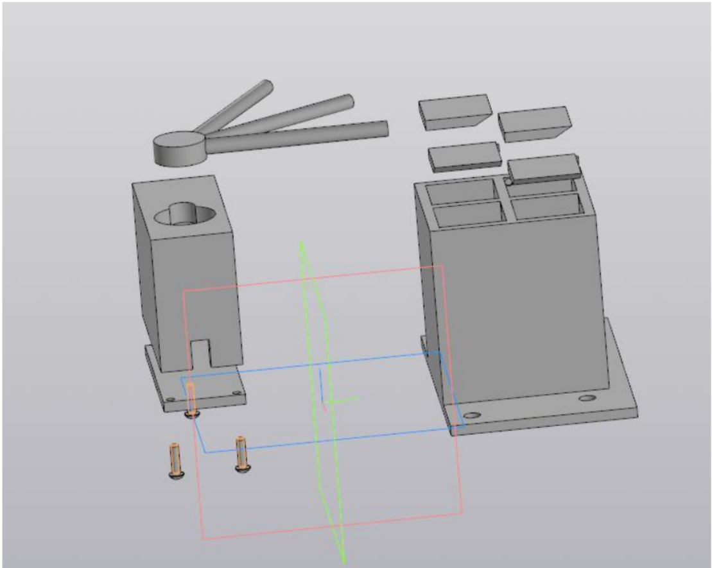
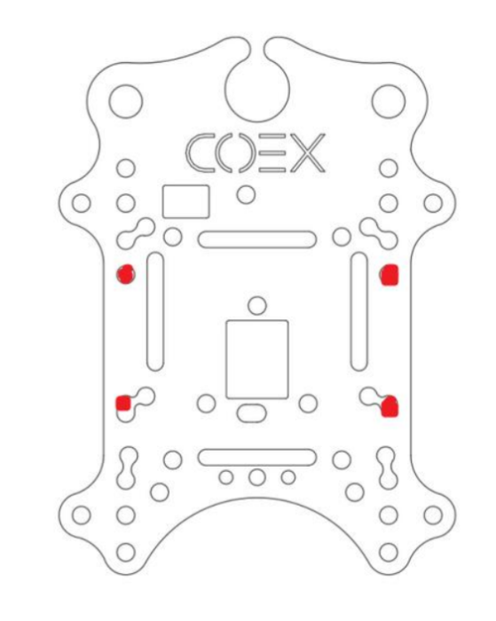
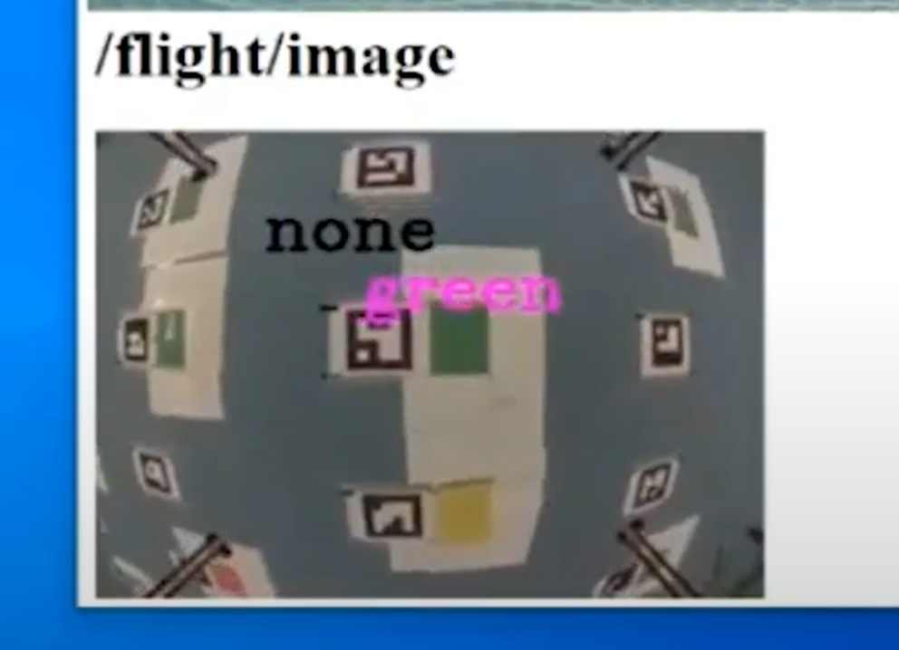

* Все видео на диске https://drive.google.com/drive/folders/1DVd-aEOdxTWsrlxUzUQNFPh5bESpJsHu
## Техническое описание проекта

### Устройство выгруза тестов

- В ходе работы создавалось устройство, которое крепилось бы на квадракоптер, имело небольшой вес и габариты, которое могло бы сбрасывать по одиночке 4 груза.
- Модель устройства в сборном виде

- Модель функционального устройства в разобранном виде -

  

- Место крепления к квадракоптеру

  

- Устройство представляет собой следующий механизм.

  - Груз помещается в 4 ячейки прямоугольного контейнера.
  - Три лепестка сдерживают крышки четырех ячеек с грузом, чтобы они открывались только в нужный момент. Открытие именно определенной крышки производилось вращением сервопривода вместе с лепестками на определенный угол.
  - Работа в действии есть в видео Video_presentation.mp4

- При возникновении проблем с монтированием крышек для ячеек было придумано решение обмотать лепестки поверхностью любым материалом, хотя бы сопоставимым с прочностью бумаги. При этом функциональность устройства осталась бы прежней
- Механизм сборки см. видео Video_sborka.mp4

### Програмный код

Была написана программа для полностью автономного прохождения миссии.

- Код находится в файле flight2.py, в котором объявлены все методы, ноды и работа с топиками.

####  Автономная миссия

В процессе полета запускаются 2 функции. Первая это detection_flight(), с помощью которой осуществляется полет к каждому из пациентов и определяется их температура, а вторая - это check_flight().

~~~ python
sort_flight_data(patients)

detection_flight()

arming(False)

print("Wait for 2 minutes")
rospy.sleep(120) # sleep for 2 minutes

arming(True)

check_flight()

arming(False)

print("Mission comlete!")
~~~

- Информация о распознанных qr кодах и температуре пациентов выводится в один топик \flight\image

  

**detection_flight**.

- Полет от пациента к пациенту осуществляется всегда на высоте 1.2 метра, чтобы не потерять карту меток.

- Температура определяется на высоте 0.6 метров с помощью библиотеки cv2.
- Порядок полета к пациентам был оптимизирован с помощью сортировки их координат
- При распознавании температуры пациента его статус выводится в терминал
- Также был написан код для цветовой индикации светодиодной лентой температуры пациента
- Для бесконтактной передачи груза дрон спускается на высоту 0.2, выводит надпись об успешной
- После облета всех пациентов дрон идет на базу, отключает двигатели, выводит всю статистику по температурам пациентов и стоит 2 минуты

**check_flight**

- Распознавание qr кодов и облет пассажиров идет по такому же алгоритму, как и в detection_flight
- Для распознавания qr кодов была использована библиотека cv2 и pyzbar.
- При обнаружении кода в терминал выводится информация о статусе пациента.
- Также написан код для индикации заражения светодиодной лентой

### Итог
- Программа обеспечивает:
- полет к пациентам с известными координатами
- точную цветовую индикацию пациентов
- возвращение домой с ожиданием

Также отдельные функции color_recognition(image) и qr_recognition(image) были проверены и их можно использовать в своих проектах
